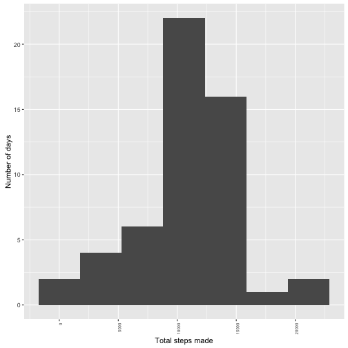
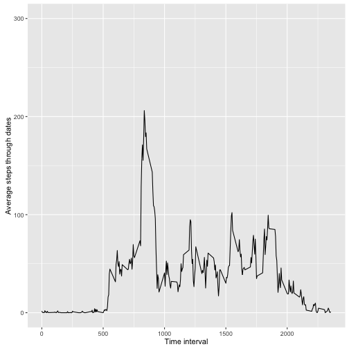
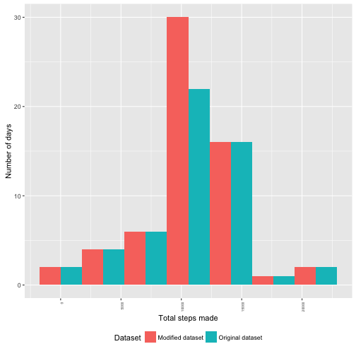
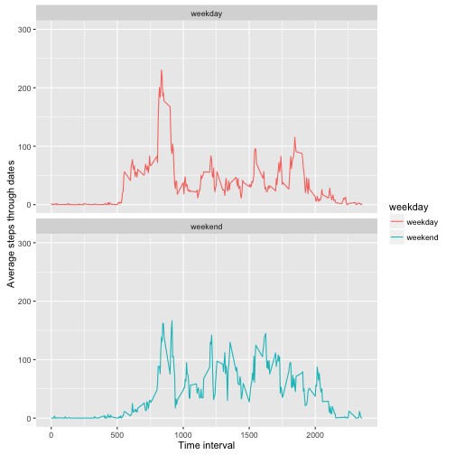

## Loading and preprocessing the data


```r
library(dplyr, warn.conflicts = F)
library(ggplot2, warn.conflicts = F)
dataset_archive <- "./activity.zip"
unzip(zipfile = dataset_archive, exdir = "./")
dataset <- read.csv("./activity.csv")
dataset$date <- as.Date(dataset$date)
```

## What is mean total number of steps taken per day?

### Total steps made by day


```r
steps_by_date <- dataset %>% filter(!is.na(steps)) %>% group_by(date) %>% summarise(steps=sum(steps))
ggplot(steps_by_date, aes(x=steps)) +
      geom_histogram(bins=7)  +
      ylab("Number of days") +
      xlab("Total steps made") +
      theme(axis.text.x = element_text(angle = 90, hjust = 1, size=6))
```



### Mean and median total number of steps taken per day


```r
mean(steps_by_date$steps)
```

```
## [1] 10766.19
```

```r
median(steps_by_date$steps)
```

```
## [1] 10765
```


## What is the average daily activity pattern?

### Tme series plot of the 5-minute interval (x-axis) and the average number of steps taken, averaged across all days (y-axis)


```r
steps_by_interval <- dataset %>% filter(!is.na(steps)) %>% group_by(interval) %>% summarise(steps=mean(steps))

ggplot(steps_by_interval, aes(x=interval, y=steps, group=NA)) +
      geom_line()  +
      ylab("Average steps through dates") +
      xlab("Time interval") +
      ylim(0, 300)
```




### 5-minute interval, which contains the maximum number of steps, on average across all the days in the dataset


```r
filter(steps_by_interval, steps == max(steps_by_interval$steps))
```

```
## # A tibble: 1 x 2
##   interval    steps
##      <int>    <dbl>
## 1      835 206.1698
```


## Imputing missing values

### Total number of missing values in the dataset


```r
dataset %>% filter(is.na(steps)) %>% count()
```

```
## # A tibble: 1 x 1
##       n
##   <int>
## 1  2304
```


### Filling missing values in the original dataset

Replacing missing steps values with either median of steps by aproppriate interval or with the steps mean across original dataset.


```r
mean_steps_by_interval <- dataset %>% filter(!is.na(steps)) %>% group_by(interval) %>% summarise(steps=mean(steps))
mean_steps_by_date <- dataset %>% filter(!is.na(steps)) %>% group_by(date) %>% summarise(steps=mean(steps))

date_mean <- function(date_f) {
    with(mean_steps_by_date, mean_steps_by_date[date==date_f,]$steps)
}

interval_mean <- function(interval_f){
    with(mean_steps_by_interval, mean_steps_by_interval[interval == interval_f,]$steps)
}

na_replacement <- function(r){
    imean <- interval_mean(r$interval)
    if(is.na(r$steps)){
        ifelse(is.na(imean) || is.nan(imean),
               ifelse(is.na(date_mean(r$date)), 0, date_mean(r$date)),
               imean)
    } else {
        r$steps
    }
}

modified_dataset <- dataset %>% rowwise() %>% do(data.frame(., steps_n=na_replacement(.)))
modified_dataset$steps <- modified_dataset$steps_n
modified_dataset <- subset(modified_dataset, select = -c(steps_n) )

summary(modified_dataset)
```

```
##      steps             date               interval     
##  Min.   :  0.00   Min.   :2012-10-01   Min.   :   0.0  
##  1st Qu.:  0.00   1st Qu.:2012-10-16   1st Qu.: 588.8  
##  Median :  0.00   Median :2012-10-31   Median :1177.5  
##  Mean   : 37.38   Mean   :2012-10-31   Mean   :1177.5  
##  3rd Qu.: 27.00   3rd Qu.:2012-11-15   3rd Qu.:1766.2  
##  Max.   :806.00   Max.   :2012-11-30   Max.   :2355.0
```

```r
summary(dataset)
```

```
##      steps             date               interval     
##  Min.   :  0.00   Min.   :2012-10-01   Min.   :   0.0  
##  1st Qu.:  0.00   1st Qu.:2012-10-16   1st Qu.: 588.8  
##  Median :  0.00   Median :2012-10-31   Median :1177.5  
##  Mean   : 37.38   Mean   :2012-10-31   Mean   :1177.5  
##  3rd Qu.: 12.00   3rd Qu.:2012-11-15   3rd Qu.:1766.2  
##  Max.   :806.00   Max.   :2012-11-30   Max.   :2355.0  
##  NA's   :2304
```

### Total steps made by day in modified dataset in comparison with the original dataset


```r
orig_steps_by_date <- dataset %>% filter(!is.na(steps)) %>% group_by(date) %>% summarise(steps=sum(steps))
mod_steps_by_date <- modified_dataset %>% group_by(date) %>% summarise(steps=sum(steps))
orig_steps_by_date$Dataset <- "Original dataset"
mod_steps_by_date$Dataset <- "Modified dataset"

ds <- rbind(orig_steps_by_date, mod_steps_by_date)
ds$type <- as.factor(ds$Dataset)

ggplot(ds, mapping=aes(x=steps, fill=Dataset)) +
      geom_histogram(bins=7, position="dodge") +
      ylab("Number of days") +
      xlab("Total steps made") +
      theme(axis.text.x = element_text(angle = 90, hjust = 1, size=5), legend.position="bottom")
```



#### Median and mean of total steps made by date in original dataset


```r
median(orig_steps_by_date$steps)
```

```
## [1] 10765
```

```r
mean(orig_steps_by_date$steps)
```

```
## [1] 10766.19
```

#### Median and mean of total steps made by date in modified dataset


```r
median(mod_steps_by_date$steps)
```

```
## [1] 10766.19
```

```r
mean(mod_steps_by_date$steps)
```

```
## [1] 10766.19
```

## Are there differences in activity patterns between weekdays and weekends?


```r
wdays <- ifelse(weekdays(modified_dataset$date) %in% c("Saturday", "Sunday"), "weekend", "weekday")
modified_dataset$weekday <- as.factor(wdays)

mod_steps_by_interval <- modified_dataset %>% group_by(interval, weekday) %>% summarise(steps=mean(steps))

ggplot(mod_steps_by_interval, aes(x=interval, y=steps, group=weekday, color=weekday)) +
      geom_line()  +
      facet_wrap(~weekday, nrow = 2) +
      ylab("Average steps through dates") +
      xlab("Time interval") +
      ylim(0, 300)
```


